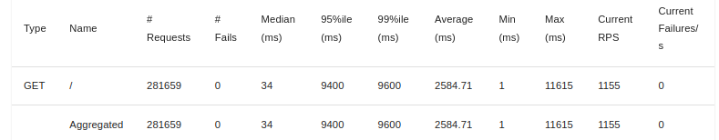
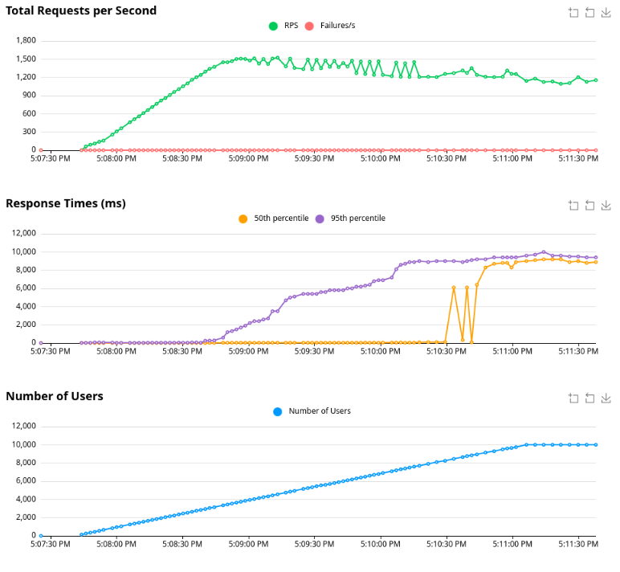

# Rust http server

Serving my portfolio on a http server written in rust

## Overview
+ Asynchronous web server written in rust
+ serves my developer portfolio

## asynchronous load test

On my home PC, this rust webserver handles:
+ 8000+ simultaneous users
+ 50th percentile wait time at 100ms
+ 1500 requests per second

